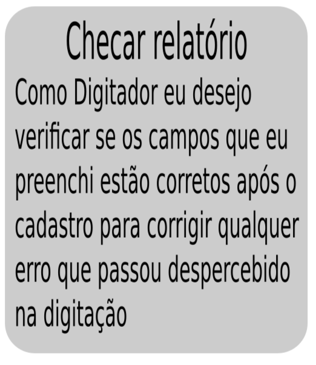
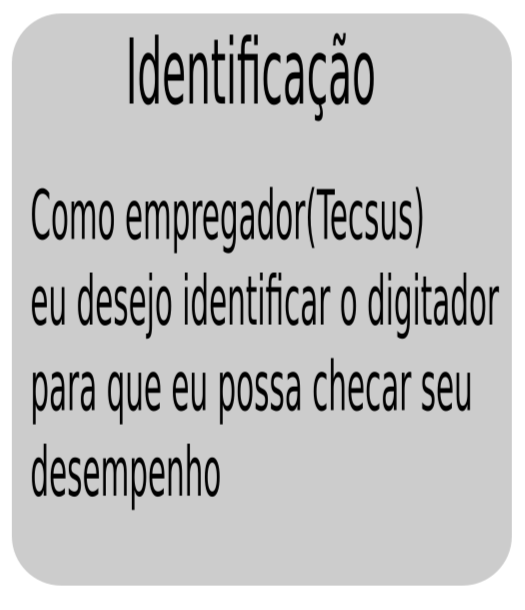

# Projeto Integrador 2

Software para cadastro de conta de água e luz para a empresa Tecsus.

## Features

- Feito com: Java

## Funções do sistema:

- Cadastro de Contas de Água e Luz em um Banco de Dados;
- Identificação do digitador através de um login;
- Criar um arquivo .csv com os dados das contas cadastradas;

### Integrantes da Equipe

- Danillo - Desenvolvedor
- Devanir - Scrum Master
- Johnny - Desenvolvedor
- Jonatas Ferreira - P.O.

## Sprint 4:

- Objetivos da entrega:
   - Adicionar comandos para atualizar e deletar dados no Banco;
   - Adicionar máscaras nos campos;
   - Ao salvar a conta o nome do digitador também é salvo;
   - Criação de um arquivo .csv como relatório de uma conta.
   
   
   
   
- Instalação:
   - Download "programa_executável.zip"
   - Descompactar os arquivos em sua pasta desejada
   - Leia o guia de usuário para instruções de uso(readme.txt)
   - Linux:
      - No terminal vá até a pasta em que você extraiu os arquivos e digite:
      
            ```
            $ java -jar PrepararBanco.jar
            $ java -jar CadastroDeContas.jar
            ```
   - Windows:
      - Procure por "command prompt" inicie como admin com o botão direito, vá até a pasta em que você extraiu os arquivos e digite:
      
            ```
            $ java -jar PrepararBanco.jar
            $ java -jar CadastroDeContas.jar
            ```
- Guia de usuário incluído no arquivo zip.

- Vídeo (sprint 3):

https://www.loom.com/share/3062732acfce4c4e943165e162f6695f


