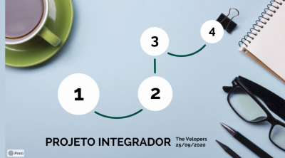

# Projeto Integrador 2

Software para cadastro de conta de água e luz para a empresa Tecsus.

## Features

- Feito com: Java

## Funções do sistema:

- Em desenvolvimento

### Integrantes da Equipe

- Carlos Vinícius - Desenvolvedor
- Danillo - Desenvolvedor
- Devanir - Desenvolvedor
- Jeferson - Scrum Master
- Johnny - Desenvolvedor
- Jonatas Ferreira - P.O.

## Sprint 1:
- User Stories Funcionais:
  - <a href="https://raw.githubusercontent.com/jef771/Projeto_Integrador_2/master/img/story_map_digitador3.png">User </a><a href="https://raw.githubusercontent.com/jef771/Projeto_Integrador_2/master/user_stories/funcionais/user_story_map.png">Stories: </a>
    - Story Card com círculo vermelho priorizado para próxima sprint.
- User Stories não Funcionais:
  - <a href="https://raw.githubusercontent.com/jef771/Projeto_Integrador_2/master/user_stories/nao_funcionais/UserStorie-1.JPG">Card 1: </a>
    - Para suprir a necessidade da Tecsus(produtividade dos digitadores) e ajudar os digitadores(facilitar o processo), uma interface ágil e simples é essencial.
  - <a href="https://raw.githubusercontent.com/jef771/Projeto_Integrador_2/master/user_stories/nao_funcionais/UserStorie-2.JPG">Card 2: </a>
    - Como o usuário será o digitador priorizamos a facilidade do processo, por isso um código rápido é essencial para acompanhar a velocidade do profissional.
  - <a href="https://raw.githubusercontent.com/jef771/Projeto_Integrador_2/master/user_stories/nao_funcionais/UserStorie-3.JPG">Card 3: </a>
    - Cliente e usuário precisam de informações diferentes para cada conta a ser cadastrada por isso uma interface que filtre informações ou uma interface separada para cada caso é importante.
  - <a href="https://raw.githubusercontent.com/jef771/Projeto_Integrador_2/master/user_stories/nao_funcionais/UserStorie-4.JPG">Card 4: </a>
    - Mais uma vez priorizamos facilitar o processo de digitação, dessa forma o cliente e usuário podem ser beneficiados.
  - <a href="https://raw.githubusercontent.com/jef771/Projeto_Integrador_2/master/user_stories/nao_funcionais/UserStorie-5.JPG">Card 5: </a>
    - É importante o usuário conhecer o software que ele está usando por isso um guia é importante.
  - <a href="https://raw.githubusercontent.com/jef771/Projeto_Integrador_2/master/user_stories/nao_funcionais/UserStorie-6.JPG">Card 6: </a>
    - O ideal para facilitar o processo.
  - <a href="https://raw.githubusercontent.com/jef771/Projeto_Integrador_2/master/user_stories/nao_funcionais/UserStorie-7.JPG">Card 7: </a>
    - Para o cliente acompanhar o consumo de água ou luz.

- Wireframes:
  - <a href="https://raw.githubusercontent.com/jef771/Projeto_Integrador_2/master/wireframe/janela_principal.png">Tela Principal</a>

  - <a href="https://raw.githubusercontent.com/jef771/Projeto_Integrador_2/master/wireframe/conta_agua.png">Tela de Conta de Água</a>

  - <a href="https://raw.githubusercontent.com/jef771/Projeto_Integrador_2/master/wireframe/conta_luz.png">Tela de Conta de Luz</a>

  - <a href="https://raw.githubusercontent.com/jef771/Projeto_Integrador_2/master/wireframe/gerar_relatorio.png">Tela para gerar Relatórios</a>
   
- Localização:
  - Master
    - <a href="https://github.com/jef771/Projeto_Integrador_2/tree/master/user_stories">user_stories(Story Cards)</a>
    - <a href="https://github.com/jef771/Projeto_Integrador_2/tree/master/wireframe">wireframe("mock up" da aplicação)</a>

- Vídeo:

   
